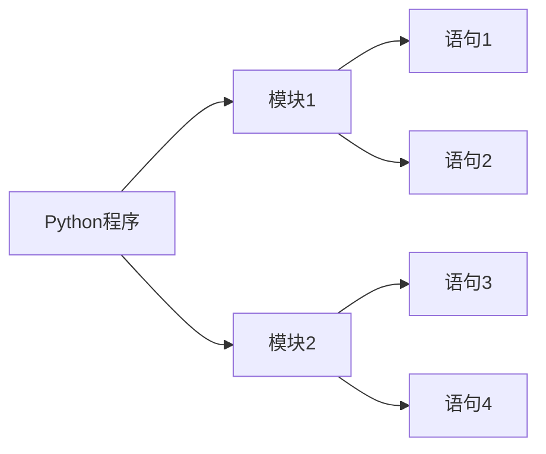

# Python程序的构成

## Python程序的组成



1. Python程序由模块组成，一个模块对应python源文件，一般后缀名是：.py。
2. 模块由语句构成，运行Python程序时，按照模块中语句的顺序依次执行。
3. 语句是Python程序的构造单元，用于创建对象、变量赋值、条用函数、控制语句等。

## 使用注释#

注释是程序中会被Python解释器忽略的一段文字，程序员可以通过注释记录任意想写的内容，通常是关于代码的说明。

Python 中的注释只有单行注释，使用# 开始知道行结束的部分。

```
>>> # 注释是个好习惯，方便自己方便他人
>>> a = [10,20,30] #生成一个列表对象，变量a引用这个变量
```
## 使用\行连接符

一行程序长度是没有限制的，但是为了可读性更强，通常将一行比较长的程序分为多行。这时我们可以用\行连接符，把它放到行结束的地方。Python解释器仍然将他们解释为同一行。

```
>>> a = [10,20,30,40,\
         50,60,70,\
         80,90,100]
```